<div align="center">



# 🌌 Simulasi Alam Semesta
### *Solar Sistem for Razeerh*


> **Simulasi interaktif alam semesta** — jelajahi tata surya, galaksi, hingga fenomena kosmik paling ekstrem di ujung jari kamu.

</div>

---

## 🚀 Fitur Utama

- **🪐 Tata Surya Interaktif** — planet mengorbit matahari secara real-time, satelit (Bulan, Europa, Titan) mengorbit planet induknya masing-masing
- **🔭 21+ Objek Kosmik** — dari planet hingga fenomena paling ekstrem di alam semesta
- **✨ Starfield Dinamis** — latar bintang berkedip di semua tampilan
- **🔍 Zoom & Pan** — perbesar/perkecil tampilan di semua mode
- **🔎 Pencarian Cepat** — cari objek langsung dengan nama Indonesia atau Inggris
- **📋 Info Panel Detail** — tiga tab: Data, Struktur Lapisan, dan Deskripsi
- **⚡ Loading Screen Animasi** — animasi cincin kosmik saat memuat
- **📱 Responsif Mobile** — dioptimalkan untuk layar HP dan desktop

---

## 🌠 Daftar Objek

### ☀️ Tata Surya
| Objek | Kategori | Keterangan |
|-------|----------|------------|
| ☀️ Matahari | Bintang Tipe G | Pusat tata surya, suhu 5.778 K |
| ☿ Merkurius | Planet Terestrial | Planet terkecil & terdekat |
| ♀ Venus | Planet Terestrial | Planet terpanas, 462°C |
| 🌍 Bumi | Planet Terestrial | Rumah kita, ada kehidupan |
| 🌕 Bulan | Satelit Bumi | Mengorbit Bumi |
| ♂ Mars | Planet Terestrial | Planet merah, Olympus Mons |
| ♃ Jupiter | Raksasa Gas | Planet terbesar, Great Red Spot |
| 🟡 Europa | Satelit Jupiter | Lautan cair di bawah es |
| ♄ Saturnus | Raksasa Gas | Sistem cincin es indah |
| 🟠 Titan | Satelit Saturnus | Danau metana cair |
| ♅ Uranus | Raksasa Es | Berotasi miring 98° |
| ♆ Neptunus | Raksasa Es | Badai super kencang |
| 🩶 Pluto | Planet Kerdil | Hati es di Sabuk Kuiper |

### 🌌 Deep Space
| Objek | Kategori |
|-------|----------|
| 🌀 Bima Sakti | Galaksi Spiral |
| 🔵 Andromeda | Galaksi Spiral |
| 🌸 Nebula | Awan Antarbintang (Pabrik Bintang) |
| 💜 Quasar | Inti Galaksi Aktif |
| ⚡ Pulsar | Bintang Neutron Berputar + Gravitational Waves |
| 🌑 Black Hole | Lubang Hitam Supermasif |
| 🧨 Supernova | Ledakan Bintang Mati |
| 🌀 Wormhole | Anomali Ruang-Waktu |
| 💫 Magnetar | Medan Magnet Terkuat |
| ⭐ Bintang Ganda | Sistem Biner Sirius |
| 🔴 UY Scuti | Maha Raksasa Merah (1.700× Matahari) |
| 🌊 Exoplanet | Planet Kembaran Bumi |
| 🟣 Dark Matter | Materi Gelap + Filamen Kosmik |
| 💥 Galaksi Tabrakan | NGC 4038/4039 |
| ⚪ White Hole | Kebalikan Black Hole (Hipotetis) |
| 🌟 Protobintang | Bintang Bayi dengan Jet Bipolar |
| 🟢 Dyson Sphere | Megastruktur Buatan Peradaban Maju |
| ☄️ Komet | Komet Halley dengan Dua Ekor |
| 🪨 Sabuk Asteroid | Jutaan Asteroid + Ceres |
| 🕸️ Cosmic Web | Jaring Laba-laba Kosmik Raksasa |
| 🔴 Raksasa Merah | Tahap Akhir Bintang, Aldebaran |
| 🔵 Bintang Neutron | Benda Terpadat Setelah Black Hole |
| 💛 Gamma-Ray Burst | Ledakan Paling Energik di Alam Semesta |

---

## 🛠️ Teknologi

```
HTML5 Canvas API    → Rendering animasi semua objek kosmik
Vanilla JavaScript  → Logika simulasi, orbit, zoom, search
Tailwind CSS (CDN)  → Styling UI komponen
CSS @keyframes      → Animasi loading screen
requestAnimationFrame → Game loop 60fps
```

---

## 📖 Cara Pakai

1. **Buka file** `simulasi-alam-semesta.html` di browser
2. **Tunggu loading** (4 detik) — loading screen akan berjalan 0% → 100%
3. **Pilih tampilan:**
   - Bar bawah: **Tata Surya / Bima Sakti / Andromeda**
   - Tombol **☰** untuk semua objek lain (21+ objek, bisa scroll)
4. **Klik/sentuh** objek untuk membuka Info Panel
5. **Zoom** menggunakan tombol `+` / `-` / `↺` di kanan bawah
6. **Cari** objek via kotak pencarian di kiri atas (support nama Indonesia & Inggris)

---

## 📁 Struktur File

```
📦 simulasi-alam-semesta/
 ┣ 📄 simulasi-alam-semesta.html   ← File utama (all-in-one)
 ┣ 🖼️  solar-system.svg            ← Animasi SVG untuk README
 ┗ 📝 README.md                    ← Dokumentasi ini
```

---

## 🎨 Screenshot

| Tata Surya | Deep Space |
|:---:|:---:|
| Planet mengorbit Matahari | 21+ objek kosmik interaktif |
| Satelit mengorbit planet induk | Info panel dengan 3 tab detail |

---

<div align="center">

**Dibuat dengan ❤️ oleh Razeerh**

*"Alam semesta itu luas — jelajahi selagi bisa."*

⭐ **Star repo ini jika kamu suka!** ⭐

</div>